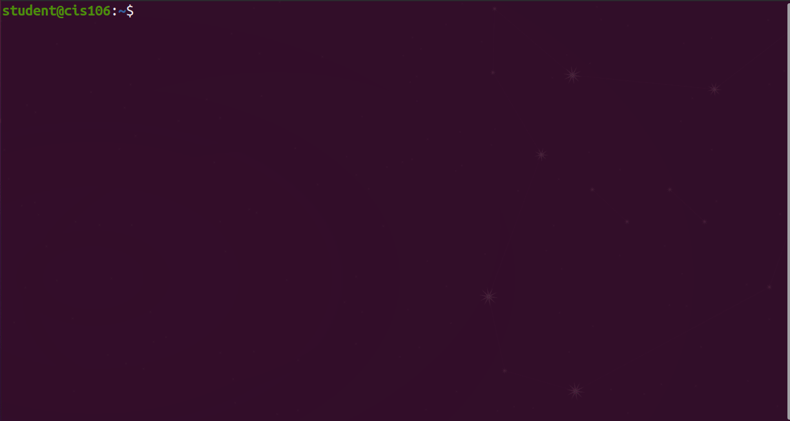
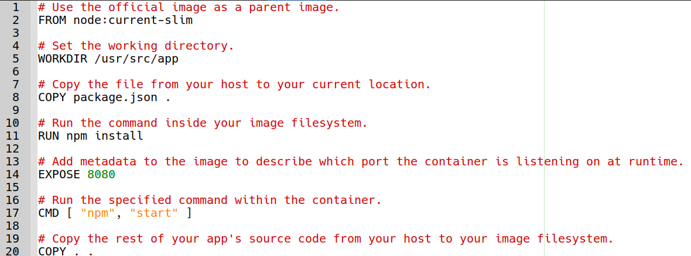
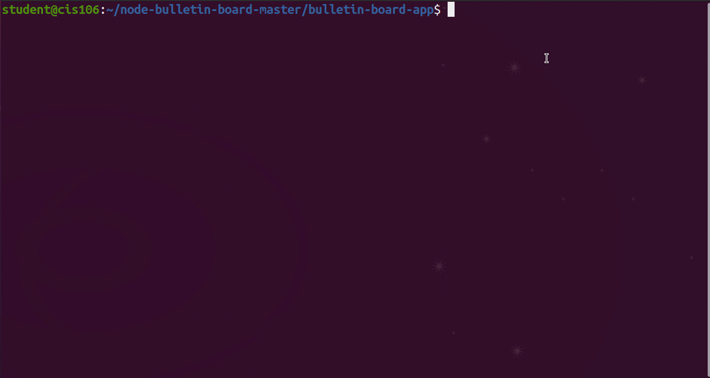
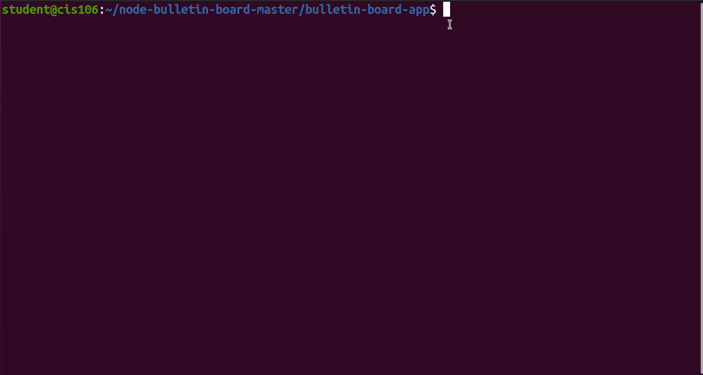

# Development process
The development workflow looks like this:
1. Create and test individual containers for each component of your application by first creating Docker images.
2. Assemble your containers and supporting infrastructure into a complete application.
3. Test, share, and deploy your complete containerized application.
--
## Download the node-bulletin-board example project.
* `curl -LO https://github.com/dockersamples/node-bulletin-board/archive/master.zip`
* `unzip master.zip`
* `cd node-bulletin-board-master/bulletin-board-app`

--
## Define a container with Dockerfile
Dockerfiles describe how to assemble a private filesystem for a container, and can also contain some metadata 
describing how to run a container based on this image.
### Sample Dockerfile

To build the docker image, run the command: `docker build --tag bulletinboard:1.0 .` from the directory that 
contains the dockerfile. In this case. `/home/$USER/node-bulletin-board-master/bulletin-board-app/`

--
## Run your image as a container
Run the following command to start a container based on your new image: `docker run --publish 8000:8080 --detach --name bb bulletinboard:1.0`

There are a couple of common flags here:

Delete the container with the command: `docker rm --force bb`

The `--force` option stops a running container, so it can be removed. If you stop the container running with docker 
stop bb first, then you do not need to use `--force` to remove it.

