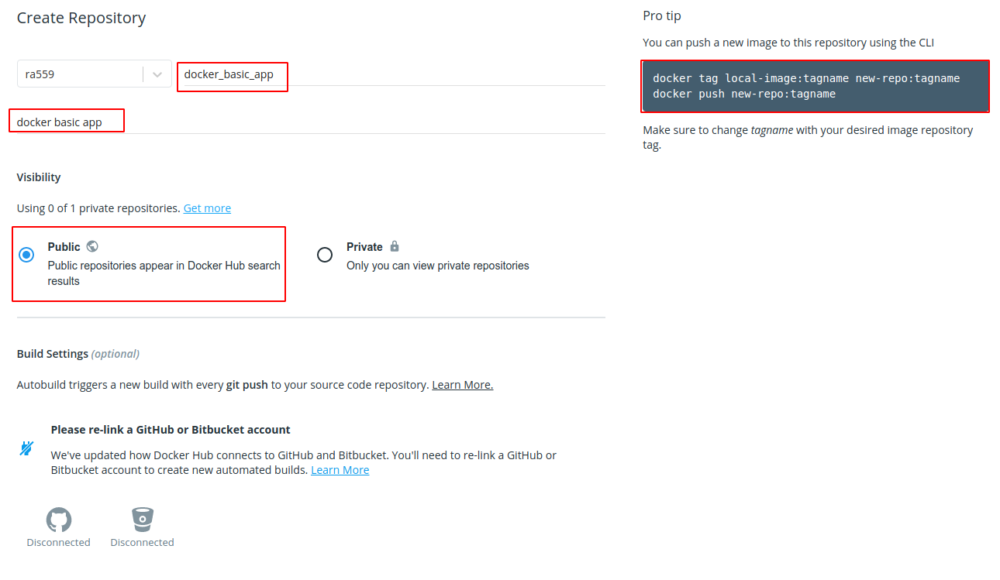
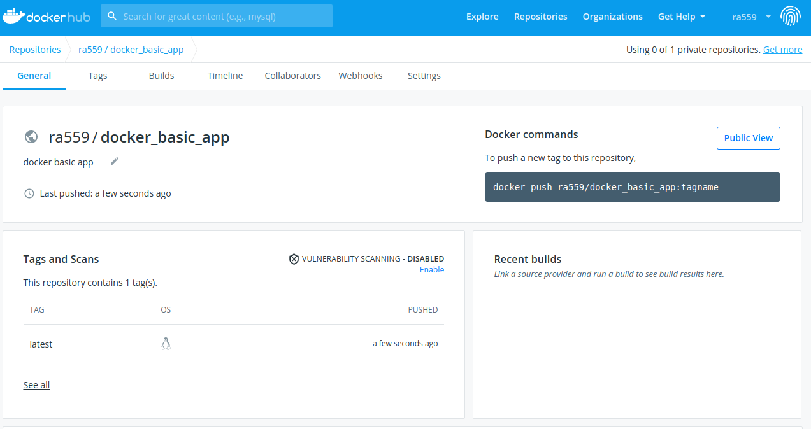

# Create a Docker Hub repository and push your image
* Create an account at [Ducker hub](https://hub.docker.com/) 
* Create a repository:

* Login to Docker Hub with `sudo docker login`
* Tag your docker image with `sudo docker tag tagname username/name-of-repo`
* Push docker image with `sudo docker push username/name-of-repo`

